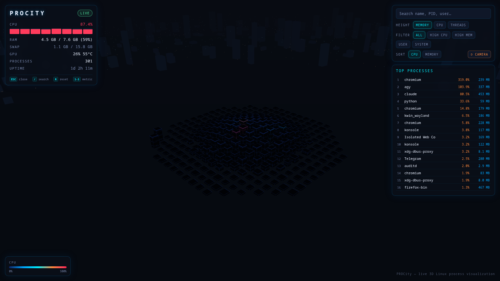
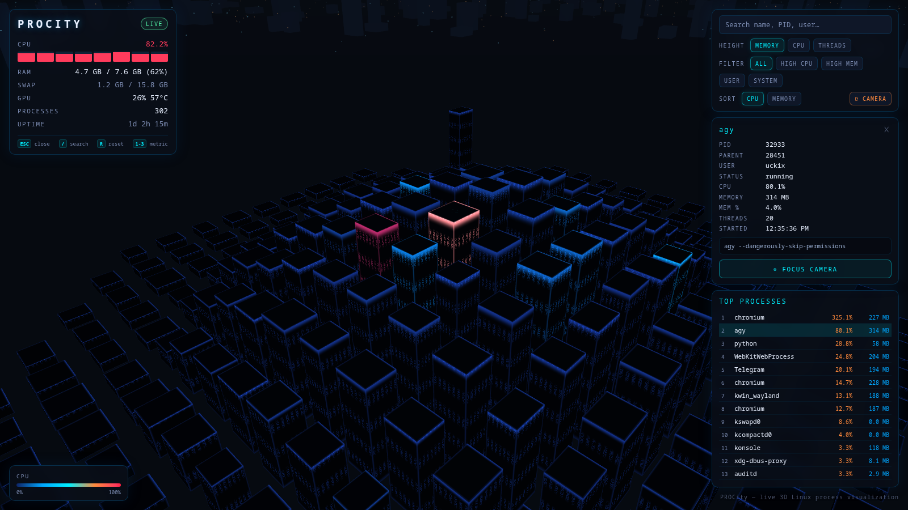

<p align="center">
  
</p>

<h1 align="center">PROCity</h1>

<p align="center">
  <b>Your running Linux processes as a live 3D neon city.</b><br>
  Every building is a real process: height = memory, colour = CPU, updated every second.
</p>

<p align="center">
  
  
  
  
</p>





## What it does

- **Live 3D city.** One building per process, all drawn in a single instanced
  draw call (1000+ buildings run smoothly).
- **Real data.** CPU, RAM, swap, per-core load, uptime, and GPU stats
  (NVIDIA, AMD Radeon, and Intel Graphics), read with `psutil` and Linux DRM sysfs. No root needed.
- **Height = memory** (or CPU, or thread count); **colour = CPU load**, going
  from dark blue through cyan and orange to red.
- **Processes come and go.** New processes rise out of the ground and exited
  ones collapse. Each process keeps its own spot in the city.
- **Click a building** to see its PID, parent, user, status, CPU, memory,
  threads and command line, then fly the camera to it.
- **Deep-linking & Automation.** Open `http://127.0.0.1:8901/?focus=top` or `?pid=<pid>`
  to jump directly to specific processes.
- **Search & Filter.** Search by name, PID or user. Filter by high CPU, high memory, user or
  system processes. Top Processes list shows the busiest ones.
- **Keyboard navigation.** Fast control with `[ESC]` (deselect), `[/]` (search),
  `[R]` (reset camera), and `[1-3]` (switch height metric).
- **Demo mode** with synthetic data (`--demo`), always clearly labelled.
- **Read-only and local.** The server listens on `127.0.0.1` only, never kills or
  changes a process, and never reads process memory.

## Install

Prebuilt releases only need **Python 3.10+**. Node.js is needed only if you
change the look and rebuild the UI.

### From a release (recommended)

```bash
# download procity-<version>.tar.gz from the Releases page, then:
tar xzf procity-*.tar.gz && cd procity-*/
scripts/install.sh --deps      # --deps installs missing system packages with sudo
```

### From a git clone

```bash
git clone https://github.com/uckix/procity.git && cd procity
scripts/install.sh --deps
```

A clone doesn't include the built UI. The installer builds it if Node.js
20.19+ (with npm or pnpm) is installed; otherwise it downloads the prebuilt UI from the latest
GitHub release.

What `--deps` installs, per distro:

| Distro            | Required                                  | Recommended (app window) |
|-------------------|-------------------------------------------|--------------------------|
| Debian / Ubuntu   | `sudo apt install python3 python3-venv`   | `chromium`               |
| Arch / Manjaro    | `sudo pacman -S python`                   | `chromium`               |
| Fedora            | `sudo dnf install python3`                | `chromium`               |
| openSUSE          | `sudo zypper install python3`             | `chromium`               |

The installer also adds a `procity` command (`~/.local/bin`) and a **PROCity**
entry in your app menu. Pass `--dev` to also install test dependencies (pytest, httpx).

## Run

```bash
procity                  # live mode: opens a standalone app window
procity --demo           # synthetic demo data
procity --no-browser     # headless / server mode (prints URL)
procity --port 8902      # custom port
procity --interval 0.5   # 2 Hz updates
```

Closing the window stops PROCity (or press Ctrl+C in the terminal). You can
also open <http://127.0.0.1:8901/> in any browser while it's running.

| Option / Flag        | Env Variable       | Default | Meaning                                    |
|----------------------|--------------------|---------|--------------------------------------------|
| `-p, --port <port>`  | `PROCITY_PORT`     | `8901`  | HTTP/WebSocket port (localhost only)       |
| `-i, --interval <s>` | `PROCITY_INTERVAL` | `1.0`   | Seconds between updates                    |
| `-m, --max <num>`    | `PROCITY_MAX`      | `1000`  | Max buildings (the busiest processes win)  |
| `--demo`             | `PROCITY_DEMO`     | `0`     | `1` = serve synthetic data                 |
| `--no-browser`       | —                  | `false` | Run without launching a browser window     |

**Controls & Shortcuts:**
- **Mouse:** Left-drag to rotate · scroll to zoom · right-drag to pan · click to select · double-click to fly to a building.
- **Keyboard:** `[ESC]` close details / clear search · `[/]` focus search input · `[R]` / `[Space]` reset camera · `[1]` memory · `[2]` CPU · `[3]` threads.


## Change the style

All colours are in two files:

- `frontend/src/theme.ts`: the 3D scene (sky, fog, ground grid, buildings,
  CPU colour gradient)
- `frontend/src/styles/main.css`, under `:root`: the panels and text

```bash
cd frontend
npm install
npm run dev        # live preview at http://localhost:5173 (with procity running)
npm run build      # then restart procity to use your version
```

See [docs/CUSTOMIZING.md](docs/CUSTOMIZING.md) for more: building sizes,
camera, thresholds and ready-made colour themes.

## Project layout

```
backend/     FastAPI + psutil monitor, GPU stats, tests
frontend/    Three.js city + HUD (TypeScript, Vite)
  src/theme.ts          ← colours of the 3D scene
  src/styles/main.css   ← colours of the panels
scripts/     install.sh · run.sh · uninstall.sh · package.sh
hyprland/    optional Hyprland window rules
docs/        customization guide, screenshots, original spec
```

## Development

```bash
backend/.venv/bin/pip install -r backend/requirements-dev.txt
backend/.venv/bin/python -m pytest backend/tests -q     # backend tests
cd frontend && npm test                                 # frontend tests
```

**Making a release:** push a tag (`git tag v1.0.0 && git push --tags`). GitHub
Actions builds the UI and publishes `procity-<version>.tar.gz` (full app,
prebuilt UI) and `procity-web.tar.gz` (UI only; clones download this). To build
the same archives locally, run `scripts/package.sh`.

## Hyprland (optional)

For a dedicated window rule see `hyprland/procity.lua` (Lua configs, current
Omarchy) or `hyprland/procity.conf` (older hyprlang configs). Nothing is
applied automatically.

## Uninstall

```bash
scripts/uninstall.sh   # removes the venv, launcher and menu entry; keeps the source
```

## Notes

- Without root, some fields of other users' processes (command line, username)
  may be hidden. That's intended: PROCity never asks for sudo to run.
- The WebSocket only accepts PROCity's own page. Requests with a foreign `Host`
  header are rejected (protection against DNS rebinding).
- GPU stats support NVIDIA GPUs (`nvidia-ml-py` or `nvidia-smi`), AMD Radeon
  GPUs (DRM sysfs), and Intel Graphics (DRM sysfs). Without a supported GPU,
  the GPU row is simply hidden.


## License

[MIT](LICENSE)
